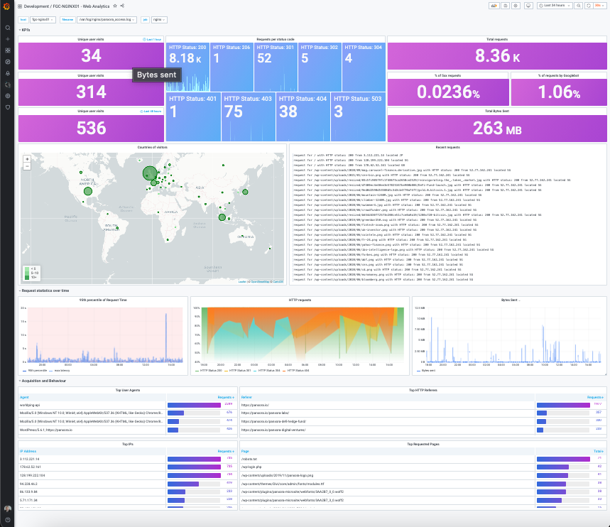

# docker-nginx

Dockerized NGINX with Letsencrypt bundled.  
When you want full control over your nginx configuration files and run certbot certificates the way you want, chained or unchained and possibly add cool logging features.

## Usage

### Deploy with docker run

```
docker run -d --name nginx -p 80:80 -p 443:443 -v /srv/nginx/log:/var/log/nginx -v /srv/nginx/conf.d:/etc/nginx/conf.d -v /srv/nginx/html:/var/www/html -v /srv/nginx/letsencrypt:/etc/letsencrypt sipstack/nginx
```

### Deploy with docker compose

```
version: "2.1"
services:
  nginx:
    image: sipstack/nginx
    container_name: nginx
    cap_add:
      - NET_ADMIN
    environment:
      - TZ=America/Toronto
    volumes:
      - /srv/nginx/log/:/var/log/nginx
      - /srv/nginx/conf.d/:/etc/nginx/conf.d
      - /srv/nginx/html:/var/www/html
      - /srv/nginx/letsencrypt:/etc/letsencrypt
    ports:
      - 443:443
      - 80:80
    restart: unless-stopped
```

## Letsencrypt Guide

### Add new certificate / to chain

```
docker exec -it nginx certbot certonly --agree-tos --email webmaster@example.com --webroot -w /var/lib/letsencrypt/ -d example.com -d www.example.com
```

### Renew

```
docker exec -it nginx certbot renew --dry-run
```

### Delete

```
docker exec -it nginx certbot delete --cert-name example.com
```

## Nginx Guide

### Usage

```
# test config
docker exec -it nginx nginx -t

# reload config
docker exec -it nginx service nginx reload

# restart nginx
docker exec -it nginx service nginx restart
```

### Examples

These configuration files should be stored in **/srv/nginx/conf.d/30-example_www.conf**

#### HTTP

```
server {
  listen 80;
  server_name example.com www.example.com;
  include snippets/letsencrypt.conf;
  include snippets/proxy.conf;
}
```

#### HTTPS

```
server {
    listen 80;
    server_name www.example.com example.com;

    include snippets/letsencrypt.conf;
    include snippets/force-ssl.conf;
}

server {
    listen 443 ssl http2;
    server_name www.example.com;

    ssl_certificate /etc/letsencrypt/live/example.com/fullchain.pem;
    ssl_certificate_key /etc/letsencrypt/live/example.com/privkey.pem;
    ssl_trusted_certificate /etc/letsencrypt/live/example.com/chain.pem;
    include snippets/ssl.conf;
    include snippets/letsencrypt.conf;

    return 301 https://example.com$request_uri;
}

server {
    listen 443 ssl http2;
    server_name example.com;

    ssl_certificate /etc/letsencrypt/live/example.com/fullchain.pem;
    ssl_certificate_key /etc/letsencrypt/live/example.com/privkey.pem;
    ssl_trusted_certificate /etc/letsencrypt/live/example.com/chain.pem;
    include snippets/ssl.conf;
    include snippets/letsencrypt.conf;

    location / {
      # include snippets/bots.conf;
      # include snippets/block-exploits.conf;
      include snippets/proxy.conf;
      include snippets/resolver.conf;

      set $upstream_app ca1;
      set $upstream_port 80;
      set $upstream_proto http;
      proxy_pass $upstream_proto://triton-$upstream_app.telair.net:$upstream_port;

    }

    # . . . other code
}
```

## Extras

When you want to transport your logs to grafana for the ultimate experience:

 
 
 > Credit: https://grafana.com/grafana/dashboards/13865

### To transport logging to grafana, add a promtail service to your stack

```
promtail:
    image: grafana/promtail:latest
    container_name: promtail
    volumes:
      - /srv/nginx/log/:/var/log/nginx/:ro
      - /srv/promtail/docker-config.yml:/etc/promtail/docker-config.yml
    restart: unless-stopped
    command: -config.expand-env=true -config.file=/etc/promtail/docker-config.yml
```

Add this config into your /srv/promtail/docker-config.yml file:

```
server:
  http_listen_port: 0
  grpc_listen_port: 0

positions:
  filename: /tmp/positions.yaml

clients:
  - url: https://<your-loki-ingestion-ip-or-domian>/loki/api/v1/push

scrape_configs:
  - job_name: system
    static_configs:
      - targets:
          - localhost
        labels:
          job: nginx_access_log
          host: example.com
          agent: promtail
          __path__: /var/log/nginx/*.json
```

### Add GeoIP files (not included)

Search for GeoIP.dat and GeoIPCity.dat and add them to your /srv/nginx/conf.d/ folder. These are the original free versions, not GeoIP v2.

### Add below logging file to your /srv/nginx/conf.d/10-promtail.conf

```
geoip_country /etc/nginx/conf.d/GeoIP.dat;
geoip_city /etc/nginx/conf.d/GeoIPCity.dat;
log_format json_analytics escape=json '{'
    '"msec": "$msec", ' # request unixtime in seconds with a milliseconds resolution
    '"connection": "$connection", ' # connection serial number
    '"connection_requests": "$connection_requests", ' # number of requests made in connection
    '"pid": "$pid", ' # process pid
    '"request_id": "$request_id", ' # the unique request id
    '"request_length": "$request_length", ' # request length (including headers and body)
    '"remote_addr": "$remote_addr", ' # client IP
    '"remote_user": "$remote_user", ' # client HTTP username
    '"remote_port": "$remote_port", ' # client port
    '"time_local": "$time_local", '
    '"time_iso8601": "$time_iso8601", ' # local time in the ISO 8601 standard format
    '"request": "$request", ' # full path no arguments if the request
    '"request_uri": "$request_uri", ' # full path and arguments if the request
    '"args": "$args", ' # args
    '"status": "$status", ' # response status code
    '"body_bytes_sent": "$body_bytes_sent", ' # the number of body bytes exclude headers sent to a client
    '"bytes_sent": "$bytes_sent", ' # the number of bytes sent to a client
    '"http_referer": "$http_referer", ' # HTTP referer
    '"http_user_agent": "$http_user_agent", ' # user agent
    '"http_x_forwarded_for": "$http_x_forwarded_for", ' # http_x_forwarded_for
    '"http_host": "$http_host", ' # the request Host: header
    '"server_name": "$server_name", ' # the name of the vhost serving the request
    '"request_time": "$request_time", ' # request processing time in seconds with msec resolution
    '"upstream": "$upstream_addr", ' # upstream backend server for proxied requests
    '"upstream_connect_time": "$upstream_connect_time", ' # upstream handshake time incl. TLS
    '"upstream_header_time": "$upstream_header_time", ' # time spent receiving upstream headers
    '"upstream_response_time": "$upstream_response_time", ' # time spend receiving upstream body
    '"upstream_response_length": "$upstream_response_length", ' # upstream response length
    '"upstream_cache_status": "$upstream_cache_status", ' # cache HIT/MISS where applicable
    '"ssl_protocol": "$ssl_protocol", ' # TLS protocol
    '"ssl_cipher": "$ssl_cipher", ' # TLS cipher
    '"scheme": "$scheme", ' # http or https
    '"request_method": "$request_method", ' # request method
    '"server_protocol": "$server_protocol", ' # request protocol, like HTTP/1.1 or HTTP/2.0
    '"pipe": "$pipe", ' # "p" if request was pipelined, "." otherwise
    '"gzip_ratio": "$gzip_ratio", '
    '"http_cf_ray": "$http_cf_ray",'
    '"geoip_city": "$geoip_city", '
    '"geoip_longitude": "$geoip_longitude", '
    '"geoip_latitude": "$geoip_latitude", '
    '"geoip_country_code": "$geoip_country_code"'
'}';
```

Finally, to log only service hosts or folders, add the below to your nginx conf file either in the sever{} or location{} blocks.

```
access_log /var/log/nginx/example_com.json json_analytics;
```
